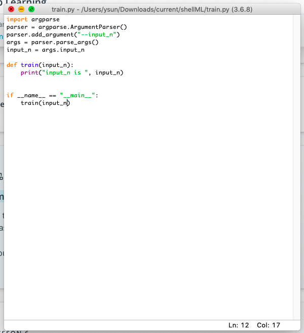

# FAQ for Udacity Intro to Machine Learning Nanodegree | Mentorship FAQ

# FAQ
- FAQ 000	When in doubt email support@udacity.com Ans: 000
- FAQ 001	Error VGG object has no attribute error. Ans: 001, 002
- FAQ 002	How to access hidden layers of Pytorch pre-trained model Ans: 001, 002
- FAQ 003 	How to access a Pytorch Sequential object Ans: 001, 002
- FAQ 004	Google Colab Best Practice Ans: 003,
- FAQ 005	Article recommendations for imbalanced data classes Ans: 004, 005, 009
- FAQ 006	Transfer learning with Pytorch Ans: 006
- FAQ 007 	Categorical Encoding Ans: 007
- FAQ 008	How to check the rank of a tensor? Ans: 010
- FAQ 009	Anaconda environment cheat sheet Ans: 011
- FAQ 010	Pytorch Cheatsheet | Pytorch 101 Ans: 012, 006
- FAQ 011	Trending deep learning technology GANs: living portrait aka few-shot adversarial learning 015 014, AI portraits 013
- FAQ 012   VGG16... multiple linear layers within the classification layer, so to get the in_features, the command would be model.classifier[0].in_features ... resnet18, the command would need to be model.fc.in_features.  How can I write a general command, which would give me the in_features, no matter which model is passed? asked by FK. This question is also interpreted as building transfer learning pipeline, a workflow, aka a pre-trained model workflow in pytorch. 
- FAQ 013	Best way to visualize and understand Convolutional Neural Networks kernels, aka filters Youtube video 017, visualization animation 018, intuition 019, advanced 020, 021, 022, 023
- FAQ 014	I want to add a fourth dimension to my seaborn plot, what shall I do? Ans 024
- FAQ 015	Github contribution guideline, how do you make your commits count, how to get credit for the github activity tracker Ans: 024
- FAQ 016 My data frame looks different every time I run it. 
- FAQ 017 What should I expect at the end of the course? What would I gain from this course? Ans:026
- FAQ 018 Is it normal to spend so much time data cleaning in the last project Customer Segmentation? Ans: 027
- FAQ 019 Where do I find summary data, meta data of the dataset for Customer Segmentation? How do I know which unknown or missing values to replace? Ans: 028
- FAQ 020 Paper on data augmentation. Ans: 029
- FAQ 021 Batch size and stochastic gradient descent Ans: 030
- FAQ 022 Introduction to ArgParse command line with python Ans: 031 041
- FAQ 023 Tips for working on a command line deep learning project. Ans: 032
- FAQ 024 Save your dataset and progress with python pickle file. Ans: 033
- FAQ 025 show me an example of using lambda Ans: 034
- FAQ 026 show me an example of using lambda in pandas dataframe Ans: 034
- FAQ 027 how to programmatically modify a column in pandas dataframe Ans: 034
- FAQ 028 How matplotlib works under the hood 035
- FAQ 029 New student welcome, wiki and logistics Ans 036
- FAQ 030 Working with command line argparse example Ans 037
- FAQ 031 Transfer learning explained Ans 038
- FAQ 032 CUDA model, data RuntimeError: Expected object of type torch.FloatTensor but found type torch.cuda.FloatTensor Ans 039
- FAQ 033 Need a refresher on Linear Algebra, need help with the matrix multiplication in linear regression and neural networks. 
- FAQ 034 RuntimeError: Expected object of type torch.FloatTensor but found type torch.cuda.FloatTensor for argument Ans 042
- FAQ 035 How much linear algebra do I have to know? Ans 043
- FAQ 036 scikit-learn sklearn cheat sheet Ans 045
- FAQ 037 I want to learn more about reinforcement learning and self-driving cars. Ans 046
- FAQ 038 PCA ValueError Answer 047
- FAQ 039 Support Vector Machine Ans 048
- FAQ 040 Data cleaning, data augmentation explained. Ans 049
- FAQ 041 Github profile github help. Ans 050
- FAQ 042 Image Classifier in the command line. What does my folder structure look like? Ans 051


# ANSWERS
- Answer 000 When in doubt email support@udacity.com
- Answer 001 [Pytorch Forum VGG Object Has No Attribute Error](https://discuss.pytorch.org/t/vgg-object-has-no-attribute-fc/9124/3)
- Answer 002 [Pytorch Transfer learning on Medium](http://bit.ly/transfer_learning_pytorch)
- Answer 003 When starting a session in colab, the runtime environment is reset. Be sure to save checkpoint and data, back up the Jupyter Notebook often. 
- Answer 004 [Techniques handling imbalanced data](https://www.kdnuggets.com/2017/06/7-techniques-handle-imbalanced-data.html)
- Answer 005 [What metrics should we use on imbalanced dataset](https://towardsdatascience.com/what-metrics-should-we-use-on-imbalanced-data-set-precision-recall-roc-e2e79252aeba)
- Answer 006 [Transfer learning with pytorch code snippets Uniqtech on Medium](https://medium.com/data-science-bootcamp/transfer-learning-with-pytorch-code-snippet-load-a-pretrained-model-900374950004)
- Answer 007 [Categorical encoding](https://pbpython.com/categorical-encoding.html)
- Answer 008 [One Hot Encode Data in Machine Learning Machine Learning Mastery](https://machinelearningmastery.com/why-one-hot-encode-data-in-machine-learning/)
- Answer 009 [Imbalanced Datasets](https://blog.dominodatalab.com/imbalanced-datasets/)
- Answer 010 Check the rank of a tensor by checking the len of its shape tuple `len(tensor.shape)` For example if the rank is 3 then it is a 3-dimensional tensor.
- Answer 011 [Anaconda Miniconda Cheatsheet for Data Scientists](https://link.medium.com/Rw63GQ2peY)
- Answer 012 [Pytorch Cheatsheet for Beginners | Udacity Deep Learning Nanodegree | Udacity Intro to Machine Learning Uniqtech on Medium](https://medium.com/@uniqtech/pytorch-cheat-sheet-for-beginners-and-udacity-deep-learning-nanodegree-5aadc827de82)
- Answer 013 [Create your own Renaissance portraits](https://www.fastcompany.com/90376689/what-you-look-like-as-an-renaissance-painting-according-to-ai)
- Answer 014 [Living portraits by Samsung](https://petapixel.com/2019/05/24/samsung-ai-can-turn-a-single-portrait-into-a-realistic-talking-head/)
- Answer 015 “Few-Shot Adversarial Learning of Realistic Neural Talking Head Models,” a team of researchers at the Samsung AI Center in Moscow, Russia
- Answer 016 Use `model.children()` to access the layers of a NN in Pytorch. It is a generator, so we `append` each layer into a list variable called `result`, access and replace the entire last section using `result[-1]`. `type()` check the last element, if `Sequential` then use `result[-1][0].in_features`, else if `type` is `Linear` use `result[-1].in_features`
- Answer 017 [Luis Serrano from Udacity explains CNN filters and kernels in a youtube video](https://www.youtube.com/watch?v=2-Ol7ZB0MmU)
- Answer 018 [Best animation and visualization for Convolutional Neural Network kernels spanning](https://iamaaditya.github.io/2016/03/one-by-one-convolution/)
- Answer 019 Kernels are usually a small matrix you use to scan your original image to find small patterns for example this 3 x 3 kernel `[[0,0,0],[1,1,1],[0,0,0]` is create for finding horizontal lines, because any multiplication that is not in the center axis will be 0, only if the original image also have a specific pattern like [256, 256, 256] for example this matrix multiplication will result in a large number. If the output of the convolution is small it means the pattern is not found. A slanted line kernel looks like `[0,0,1],[0,1,0],[1,0,0]` if you imagine this matrix is a squared 3x3 matrix, the pattern looks like this `/` and a line slanted to the left `\` looks like `[1,0,0][0,1,0][0,0,1]`
- Answer 020 [Understanding your convolution network with Visualization](https://towardsdatascience.com/understanding-your-convolution-network-with-visualizations-a4883441533b)
- Answer 021 [Understand CNN Stanford CS231](http://cs231n.github.io/understanding-cnn/)
- Answer 022 [Filter Visualization](https://jacobgil.github.io/deeplearning/filter-visualizations)
- Answer 023 [Understanding convolutional neural network through visualization in pytorch](https://towardsdatascience.com/understanding-convolutional-neural-networks-through-visualizations-in-pytorch-b5444de08b91)
- Answer 024	Many seaborn plots allow you to easily display comparable data side-by-side by setting `hue` color.  Example 
```
import seaborn as sns
sns.factorplot('income', 'capital-gain', hue='sex', data=data, kind='bar', col='race', row='relationship')
```
Check out this Titanic plot where the hue is `class`. `sns.countplot(x='survived',hue='class',data=df) https://stackoverflow.com/questions/50319614/count-plot-with-stacked-bars-per-hue
- Answer 024 [Why are my contributions not showing up on my profile](https://help.github.com/en/articles/why-are-my-contributions-not-showing-up-on-my-profile)
- Answer 025 When in doubt lower the learning rate to help the model converge.
- Answer 026 Some algorithms are sensitive to initialization - weight initialization, centroid initialization, use random_state, or random seed to get reproducible results
- Answer 026 Ability to consume literature, entry-level understanding of research in Machine Learning, Artificial Intelligence, get exposure to Deep Learning, ability to understand classical ML models
- Answer 027 It is estimated that majority time cost of a data science project is spent on data cleaning, so this project mimics a real world project. See soure: data scientists spend most of their time massaging rather than mining or modeling data http://www.forbes.com/sites/gilpress/2016/03/23/data-preparation-most-time-consuming-least-enjoyable-data-science-task-survey-says/
- Answer 028 This project also mimics real life data science projects and Kaggle competitions that it comes with meta files and summary files that describe the encoding the data. Click Menu > Open in the Jupyter Notebook menu to view the actual files. or use command line commands in Jupyter Notebook `!ls` to show files `cat replace_your_file_name.md` to view files. Be sure to change the file name after the `cat` command to your own. 
- Answer 029 Data augmentation scaling, rotations, mirroring, and/or cropping. The Effectiveness of Data Augmentation in Image Classification using Deep Learning Jason Wang Stanford University Luis Perez Google. http://cs231n.stanford.edu/reports/2017/pdfs/300.pdf
- Answer 030 Batch size and stochastic gradient descent https://stats.stackexchange.com/questions/140811/how-large-should-the-batch-size-be-for-stochastic-gradient-descent/141265#141265
- Answer 031 https://pythonprogramming.net/argparse-cli-intermediate-python-tutorial/
- Answer 032 1. Don't panic, don't be overwhelmed by the amount of code. 2. Focus on high level "APIs" first: what kind of functions, classes are linked, how does the code flow, which function calls another. 3. You can even draw a picture that illustrates the code logic. 4. Think about each function's signature: what kind of inputs it takes and what kind outputs it returns. 5. Think about high level what each function wants to achieve, and how it fits in the large picture. For example: data cleaning, transformation pipeline, data augmentation, training loop, calculating loss, forward backward, evaluation loop.
- Answer 033 if you want to save the progress of your training or your pandas dataframe you can use python pickle files read more here my_dataframe.to_pickle(file_name) [Getting started with python pickle](https://www.siliconvanity.com/2017/12/getting-started-with-python-pickle.html)
- Answer 034 
```
import pandas as pd
test = [1,2,3,4]
test = pd.Series(test) #cast the list variable as a Pandas Series
test.apply(lambda x: x+1) 
# Pandas.Series.apply() allows us to a function to each entry in the Series
# We use a lambda function
# Some alteratives are list comprehension, named function,
# anonymous function in other languages like javascript
# the format of a lambda function is
# the key word "lambda" followed by the argument or input such as "x" or "x,y"
# then a colon ":"
# then the expression to be returned
# in this case x+1
# add one to x
# [1,2,3,4] becomes [2,3,4,5]
# dear students
# we can schedule a one-on-one meeting to go over lambda usage
# contact me today
```

- Answer 035 [matplotlib explained](https://www.siliconvanity.com/2019/08/matplotlib-explained-kite-blog.html)
- Answer 036 [New students welcome](https://docs.google.com/document/d/1wRDL1NEFEzgXdhLwKGlcxvgyIen2Bb3REEWq29eMf2Y/edit?usp=sharing) New student welcome, wiki and logistics
- Answer 037 


If you run `python train.py --input_n 1` You have to run your command line command in the same folder as your script. returns `('input_n is ', '1')`
In Jupyter Notebook you can run command line commands by prepending an exclaimation mark `!`. `!ls` instead of `ls` to list all the files in the directory. Open a Jupyter Notebook and run `!ls` in a cell. You can see what's in the Udacity working directory. Very useful for Customer Segment project as well.
- Answer 038 [Transfer Learning](https://machinelearningmastery.com/transfer-learning-for-deep-learning/) [Transfer Learning](https://medium.com/data-science-bootcamp/transfer-learning-with-pytorch-code-snippet-load-a-pretrained-model-900374950004)
- Ans 039 This can be an error when both the model as well as the data didn't move to GPU together, and or didn't move back to CPU together. It can help if we only moved one of the two, or it can happen because we used `model.to(torch.device('cuda'))` but didn't re-assign the `model` variable like such `model = model.to(torch.device('cuda'))`. Why? Because `.to()` returns a new tensor or a new variable, and is not an in-place operation. 
- Ans 040 Free Udacity Linear Algebra Course https://www.udacity.com/course/linear-algebra-refresher-course--ud953
- Ans 041 argparse documentation https://pytorch.org/docs/stable/notes/cuda.html#device-agnostic-code
- Ans 042 Always always mean that your model and data are not in the same location together, whether that location is CPU or GPU. 
You can check the location of your data and model by inferring from their tensor type
There are at least two ways to check type
`model = model.to(device)` move model to device and also re-assign the model variable so we can type check
`type(model_name)`, `type(data_name)`
`vgg_model.classifier[1].weight.type()`
type check the variables and or type check the weight parameter of the model or classifier

- Ans 043 
- That's a great question. As previously mentioned, an overview of the linear algebra review is nice, but definitely no need to cover all aspects. The most important are matrix multiplication dot product, matrix dimension during the multiplication, you won't be needing the transformation operations in the last section in a long while so feel free to skip now come back later. It's a great question because we definitely want to be strategic. Time is limited for the nanodegree.


In addition these are useful : magnitude, matrix addition (adding a bias in Neural Network), identity matrix,

You just need a brief review, and get an intuition. No need to understand all now :) don't worry if this is a foreign concept. Often we found student need a good intuition of the concept to move ahead, not necessarily the entire discipline.

After the nanodegree, you will find that consuming literature, news and even some technical papers in deep learning and machine learning will become much easier!


To summarize a few points: during matrix multiplication the inner dimension must match matmul of dimension m x n to n x l will result in a matrix of m x l

matmul of matrix of dimension m x n to s x l will result in error because n and s do not match

there are operations that are equivalent: matrix subtraction can be seen as an equivalent of matrix addition, for example take Matrix A and B (matrix is always noted in capped form), A+B is easy element wise addition, dimension m x n must match, because it is an element-wise operation

A-B is the same as A + -1(B) so it is equivalent to A + the scalar multiplication of -1 and matrix B

you will notice that in Udacity code X the input and W the matrix is capped at times, that refers to them being matrices

the small y output is a vector so it is not capped

Magnitude sounds like a new concept but in 2 dimensions, it is the euclidean distance between two points, calculated using the pythagorean theorem ||V|| ** 2= V_x**2 + V_y**2 in computer science **2 means squared. You can see ||V|| the double bar denotes the magnitude or L2 norm is the hypothenuse of a triangle formed by V_x and V_y

The L1 norm manhattan distance is something we are familiar with |V| a single bar! Aka the absolute value.

Linear algebra sort of explain everything we missed in algebra and calculus. It's crazy useful

y = X W + b it looks like a linear line formula but it is the output label vector y = big input matrix X weighted by big weight matrix W add a bias term which is also a vector. This formula is the essence of neural networks.

Looks complicated but surprisingly simple

Pandas and Numpy use a lot of vector math - matrix math to speed up computation. A trivia to know is that PCA use matrix factorization to reduce dimensions. If you encounter this section in the refresher course, no need to know the details, it is a bit hard, but knowing the intuition is useful. The concept of orthogonal which in 2 dimensions means perpendicular is useful too. Also just need to know the high level intuition.

I keep saying 2-dim because linear algebra can calculate any dimensions. Often in NN the dimensionality can be as high as millions or more for example a 28 by 28 pixel image x 3 color channels and there are 10,000 images = 23520000

Matrix math is required for GPUs.

Just like we don't need to know how calculators work. We don't need to know how GPU or the Pytorch library or Numpy handles every detail of operation. We just need to know it can do it, and the intuition behind the math, high level architecture, and why it is faster than normal python loops

- Ans 044 Looking for an overview of Convolutional Neural Networks? search for CS231 a course by Stanford on youtube. Watch 1-5 episodes if possible. Definitely watch episode 5 if time is limited.
- Ans 045 [sklearn scikit-learn cheatsheet](https://medium.com/data-science-bootcamp/scikit-learn-sklearn-cheatsheet-72739349da70) use Medium membership or Browser Incognito Mode
- Ans 046 nanodegrees are by nature nano, cannot cover all hot topics, but thankfully Udacity School of AI has plenty of resources to offer. October 2019 currently the Amazon Web Service (AWS DeepRacer challenge course if on-going and free. If you want to get an intro to Reinforcement Learning, self-driving cars check it out. Of course the full Reinforcement Learning nanodegree and self-driving car nanodegree is available. I have seen BMW, Benz, Lyft and Uber recruit Udacity graduates in the self-driving nanodegree. [link](https://www.udacity.com/aws-deepracer-scholarship) AWS Deep Racer after project 1 and project 2 this course will be easy to understand
- Ans 047 PCA error ValueError: operands could not be broadcast together with shapes (6,3) (2,) . This is just an example, but notice that there's a discrepency of column dimensions? This happens when the dataset used to fit the PCA has different number of columns as the dataset we are trying to use the PCA model to transform. 
- Ans 048 https://www.kdnuggets.com/2016/07/support-vector-machines-simple-explanation.html
- Ans 049 Why so much data cleaning data augmentation? Generally machine learning models can only consume numeric data, it is important to convert images and other feature datas into tensors, which is what the Pytorch  and numpy arrays which Scikit-learn can consume. Data augmentation makes your algorithm more robust, less likely to overfit, because it is now trained on noisier data with more variations. Rotation, cropping, flipping helps with that. Why the sizing and normalization? Machine learning is quite practical but it is also empirical. We usually use what works the best. During transfer learning, we use high performance models proven to work. To feed our data into the model, we need to give the size and architecture that the model expects. Generally tricks `log` `normalization` `scaling` makes the algorithm perform better, or makes the math easier. This paragraph is also published to the FAQ page. http://bit.ly/Umentor-faq
- Ans 050 current version of the intro to ML nanodegree should have a Github Profile project in Supervised Learning session, right below the CharityML project section. 
- Ans 051 See img folder.png In this final submission folder there should be the .ipynb notebook, .html version of the notebook, train.py and predict.py


# Related FAQ 
- Pytorch VGG error no attribute 001 002
- Pytorch general 012 006
- Project CharityML

